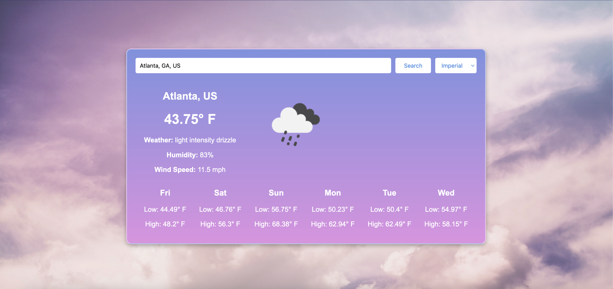

# Weather-Panel
Weather web-app built on Angular/Typescript

## Weather App
This is an Weather webapp build using Angular 19. It displays current weather and a 5-day forecast for any city. The app fetches weather data from the OpenWeatherMap API and supports both metric and imperial units.

### Features
- Current Weather: Displays the current temperature, weather condition, humidity, and wind speed.
- 5-Day Forecast: Shows the daily minimum and maximum temperatures for the next five days.
- City Search: Allows users to search for a city to view its weather and forecast.
- Unit Selection: Users can switch between metric (Celsius) and imperial (Fahrenheit) units.
- Dynamic City Handling: Prevents ambiguous results by allowing city and country/state input or selection.

> [!TIP]
> To get optimal serach results, be specific with your city and country. Search Countries using Alpha-2 Codes._
    
    Searching only 'Rome' would result in Rome, Georgia, US rather than Rome, Italy.
    To search for Rome, Italy -- search: 'Rome, IT'

    Searching only 'Arlington' would result in Arlington, Texas, rather than Arlington, Virginia
    To search for Arlington, Virginia -- search: 'Arlington, VA, US'



### Currently 2 Versions:
(Mobile UI not yet implemented)

1.  Weather Webapp with API Key hidden in angular environment.
2.  Serverless Weather Webapp with API hidden and fetched though AWS Lambda.
    - [Weather Panel](http://weather-panel.s3-website-us-east-1.amazonaws.com/)   _Note: The connection is currently not secure due to the lack of a custom domain._


## Installation and Setup

1. Clone repository:
    ```bash
    git clone https://github.com/Systemized/Weather-Panel.git
    cd weather-panel/weather-app
    ```
2. Register at [OpenWeatherMap](https://openweathermap.org/) for API key.
    ```bash
    ng generate environemnt environemnts/environment
    ```
3. Add API key to `environment.ts` & `environment.prod.ts` files, and run development server
    ```typescript
    export const environment = {
        production: true,
        openWeatherApiKey: 'INSERT_API_KEY'
    };
    ```
    ```bash
    ng serve
    ```